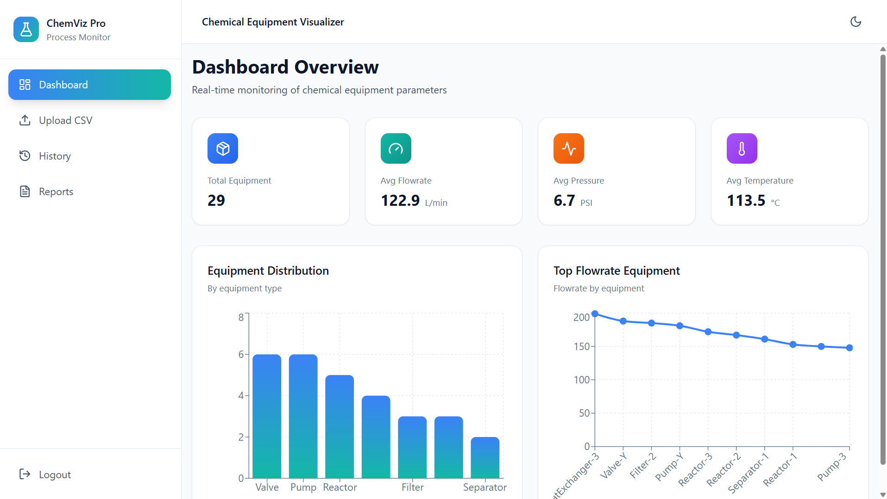
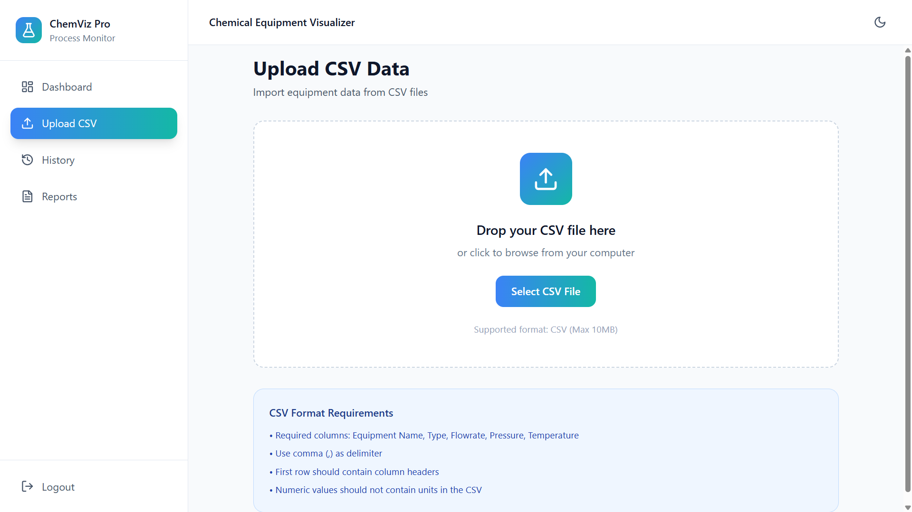
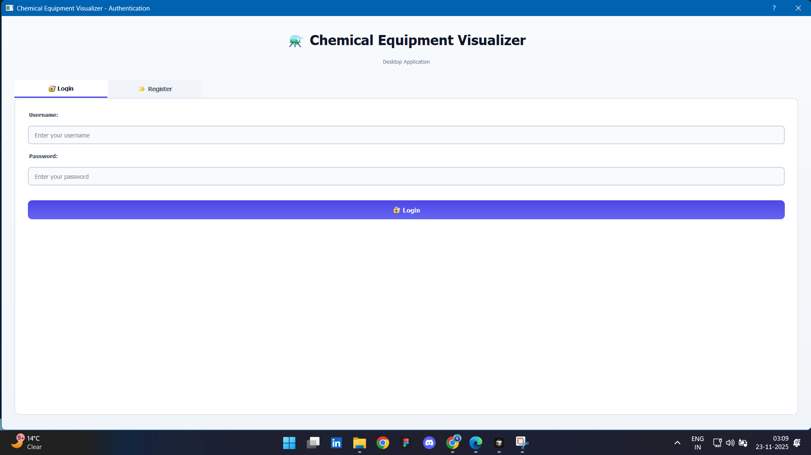
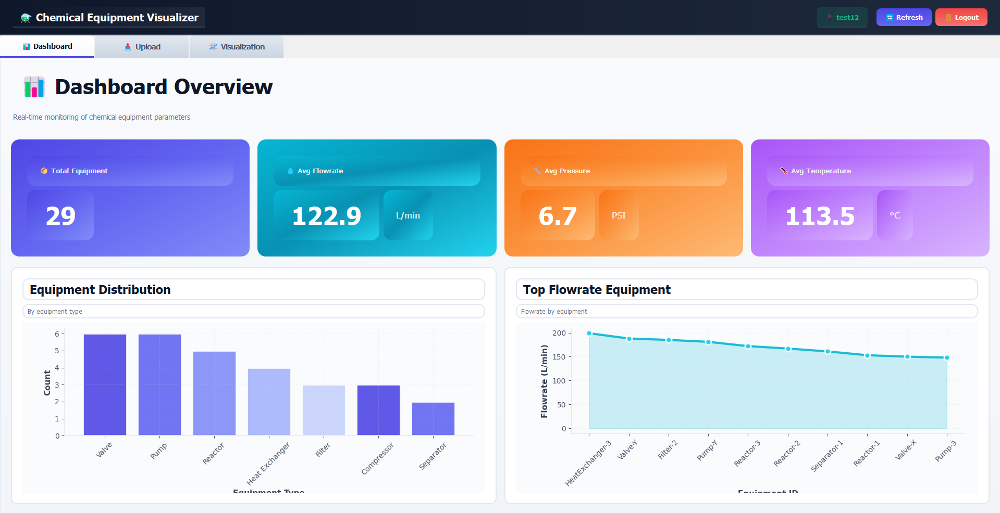
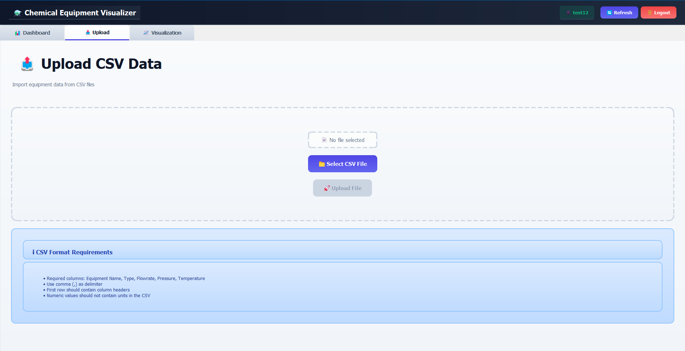
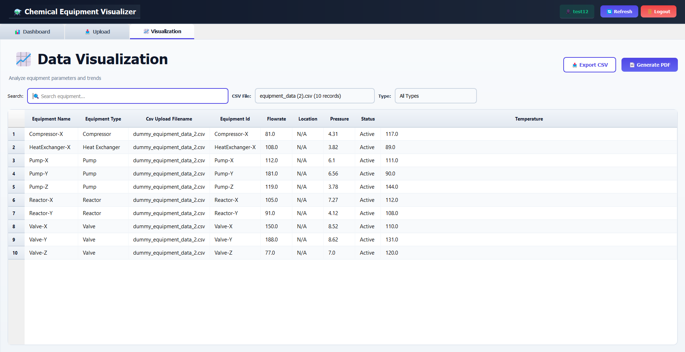

# 🧪 ChemViz Pro - Chemical Equipment Visualizer

A comprehensive full-stack application for managing, visualizing, and analyzing chemical equipment data from CSV files. Available as both a **web application** (Django REST Framework + React.js) and a **desktop application** (PyQt5 + matplotlib).


---

## ✨ Key Features

### 🌐 Web Application
- 📤 **CSV File Upload** - Upload and process chemical equipment data
- 📊 **Interactive Dashboard** - Real-time statistics and analytics
- 📈 **Data Visualization** - Interactive charts and graphs
- 🔍 **Advanced Filtering** - Filter by type, status, and CSV upload
- 📄 **PDF Report Generation** - Generate detailed equipment reports
- 🔐 **User Authentication** - Secure login and registration
- 🎨 **Modern UI** - Beautiful, responsive design with dark mode

### 💻 Desktop Application
- 🖥️ **Native Desktop App** - PyQt5-based desktop interface
- 📊 **Dashboard with Charts** - Matplotlib-powered visualizations
- 📤 **CSV Upload** - Easy file upload interface
- 📈 **Data Visualization** - View and filter equipment data
- 🔐 **Authentication** - Login/Register dialog
- 🎨 **Enhanced UI** - Modern gradients and color schemes

---

## 🖼 Screenshots

### Web Application

#### Dashboard View

*Real-time statistics and interactive charts*

#### Data Visualization

*Filter and explore equipment data*

#### CSV Upload

*Drag and drop CSV file upload*

### Desktop Application

#### Login/Register Dialog

*Modern authentication interface*

#### Dashboard Tab

*Statistics cards and charts*

#### Upload Tab

*CSV file upload interface*

#### Visualization Tab

*Data table with filtering*

> **Note**: Add your screenshots to the `screenshots/` directory and update the paths above.

---

## ⚡ Quick Start

### Prerequisites
- **Python** 3.8+
- **Node.js** 18.x+
- **npm** or **yarn**

### 1. Backend Setup (5 minutes)

```bash
cd backend
python -m venv venv
venv\Scripts\activate  # Windows
# source venv/bin/activate  # Linux/Mac
pip install -r requirements.txt
python manage.py migrate
python manage.py runserver
```

Backend runs at: `http://localhost:8000`

### 2. Web Frontend Setup (3 minutes)

```bash
cd web-frontend
npm install
npm run dev
```

Web app runs at: `http://localhost:3000`

### 3. Desktop Application Setup (2 minutes)

```bash
cd desktop-app
pip install -r requirements.txt
python main.py
```

Or use the provided script:
```bash
# Windows
run.bat
```

---

## 📁 Important Project Structure

```
chemical-equipment-visualizer/
│
├── backend/                    # Django Backend API
│   ├── manage.py
│   ├── requirements.txt
│   ├── backend/
│   │   ├── settings.py
│   │   └── urls.py
│   └── api/
│       ├── models.py          # Database models
│       ├── views.py           # API endpoints
│       ├── serializers.py     # Data serializers
│       └── utils.py           # Helper functions
│
├── web-frontend/              # React Web Application
│   ├── src/
│   │   ├── api/client.js     # API client
│   │   ├── components/       # React components
│   │   ├── pages/            # Page components
│   │   └── App.jsx           # Main app
│   ├── package.json
│   └── vite.config.js
│
├── desktop-app/              # PyQt5 Desktop Application
│   ├── main.py               # Entry point
│   ├── main_window.py        # Main window
│   ├── auth_dialog.py        # Authentication
│   ├── dashboard_tab.py      # Dashboard
│   ├── upload_tab.py         # CSV upload
│   ├── visualization_tab.py   # Data visualization
│   ├── api_client.py         # API client
│   └── requirements.txt
│
├── sample_data/
│   └── sample_equipment_data.csv
│
└── README.md
```

---

## 🛠 Tech Stack

### Backend
- **Django** 4.2.7 - Web framework
- **Django REST Framework** 3.14.0 - API framework
- **Pandas** 2.1.3 - Data processing
- **ReportLab** 4.0.7 - PDF generation

### Web Frontend
- **React** 18.3.1 - UI framework
- **Vite** 5.3.1 - Build tool
- **Tailwind CSS** 3.4.4 - Styling
- **Recharts** 2.15.2 - Charts

### Desktop Application
- **PyQt5** 5.15.10 - GUI framework
- **Matplotlib** 3.8.2 - Charts
- **Requests** 2.31.0 - HTTP client

---

## 📖 Usage Guide

### First Time Setup

1. **Start Backend Server**
   ```bash
   cd backend
   python manage.py runserver
   ```

2. **Start Web Frontend** (Optional)
   ```bash
   cd web-frontend
   npm run dev
   ```

3. **Start Desktop App** (Optional)
   ```bash
   cd desktop-app
   python main.py
   ```

4. **Register/Login**
   - Create a new account or login
   - All three applications share the same backend

5. **Upload CSV File**
   - Navigate to Upload page
   - Select CSV file with equipment data
   - Click Upload

6. **View Dashboard**
   - See statistics and charts
   - Analyze equipment data

### CSV File Format

**Required Columns:**
- `Equipment Name`
- `Type`

**Optional Columns:**
- `Flowrate`, `Pressure`, `Temperature`
- Any custom columns (e.g., `Humidity`, `Vibration`)

See `sample_equipment_data.csv` for example.

---

## 🔗 API Documentation

Interactive API documentation available at:
- **Swagger UI**: `http://localhost:8000/swagger/`
- **ReDoc**: `http://localhost:8000/redoc/`

### Key Endpoints

- `POST /api/auth/register/` - Register user
- `POST /api/auth/login/` - Login user
- `GET /api/dashboard/summary/` - Get statistics
- `POST /api/uploads/` - Upload CSV file
- `GET /api/equipment/` - List equipment
- `POST /api/reports/generate/` - Generate PDF report

---

## 📝 License

This project is licensed under the MIT License.

---

## 🤝 Contributing

Contributions are welcome! Please feel free to submit a Pull Request.

---

## 📞 Support

- **Issues**: [GitHub Issues](https://github.com/Amandev25/Chemical-Equipment-Parameter-Visualizer/issues)
- **Documentation**: See individual README files in each directory

---

**Made with ❤️ for Chemical Equipment Management**
